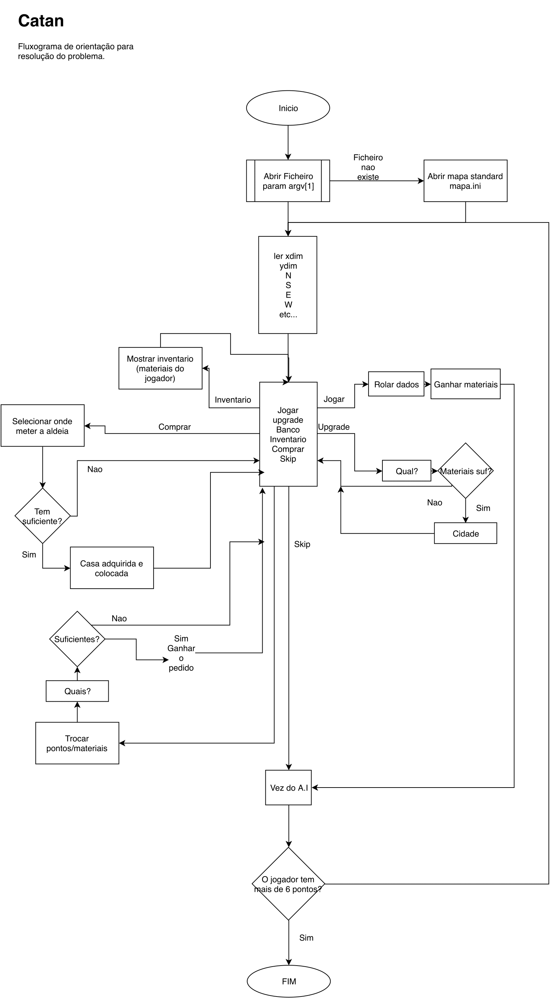

# Beware, these are not dad jokes, this is Settlers Of Japun.

# **IC: Projeto Settlers of Catan**
## Trabalho Realizado por: Rodrigo Pinheiro_a21802488 e Tomás Franco_a21803301.
#### [Repositório do github](https://github.com/ThomasFranque/IC_SettlersOfJapun).
### Solução
  + No começo do trabalho houve uma tentativa de usar o OpenGL, porém, foi posta de parte pois não havia tempo suficiente para o que queríamos.
  + Houve também, a tentativa da criação de um .c que lê-se um ficheiro .txt para a impressão do board, mas também foi posta de lado.
  + Quando se começou a mexer com o ficheiro .ini, este mostrou-se ser mais complexo do que o que esperavamos, por essa razão, em vez de trabalhar tudo na mesma coisa, o trabalho foi dividido pelos dois elementos do grupo para não se perder muito tempo.
  + Este projeto já contém algum nível de complexidade portanto a criação de um fluxograma foi essencial:
  
  + Todas as funçoes de lógica estão num único ficheiro (game_logic.c).
  + No lançamento dos dados foi também definido que seriam 2 valores aleatorios de 1 a 6 somados.
  + Não são usadas quaisqueres variaveis globais.
  + FALTA AINDA COISAS
### Referencias
##### Bibliotecas usadas
+ As bibliotecas utilizadas foram o <stdio.h>, <time.h>, <stdlib.h> e uma exterior [<ini.h>](https://github.com/rxi/ini).
##### Competencias
+ O "work flow" de trabalhar em equipa no mesmo projeto mas em partes separadas.
+ Melhor familiarizados com o GCC, C, git e doxygen.
+ Criação de um "Makefile" funcional.
+ Como jogar Settlers of Catan.
+ Que ficheiros .ini são dores de cabeça.
##### Manual de Utilizador
+ Na consola, quando no diretorio do jogo, fazer o comando _$make_ para gerar uma build do jogo.
+ Para limpar essa build basta executar o comando _$make clean_
+ Para iniciar o jogo basta executar o comando, com a build feita, _$./SOMETHING ALTERAR ISTO <--------------------_
##### Troca de Ideias
+ Brick = Brick
  Lumber = Log (for pun purposes)
  Wool = Wool
  Iron = Steel (also for pun purposes)
  Desert = Desert
+ A variavel dos locais podia ser assim:
  int locales [xdim*ydim] (sei que n dá assim, mas qd conseguirmos usar o ini talvez dê)
  depois, para vila do jogador 1 seria = 1, para cidade seria = 2, para o jogador 2, vila seria = 3 e cidade seria = 4
  nada seria = 0 como default
  um board 2x2 ficaria por exemplo:
    [1,2,0,4]
    [vilaP1, cidadeP1, nada, cidadeP2]
+ Preços:
  Aldeia: 1 Brick + 1 Log + 1 Grain + 1 Wool.
  Cidade: 1 Grain + 1 Grain + 3 Steel.
+ A troca de ideias não é muito extensa porque na resolução deste trabalho estivemos em chamada pela plataforma [Discord](https://discordapp.com) sempre que possível.
